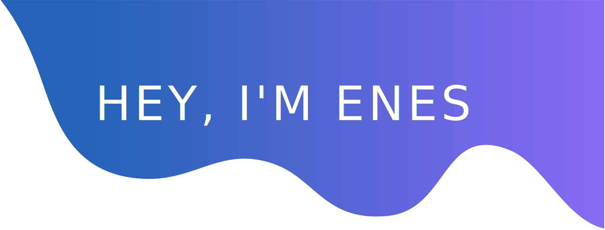

Hi there! I am Enes. I am a Software Developer. I don’t like to define myself by the work I’ve done. I define myself by the work I want to do. Skills can be taught, personality is inherent. I prefer to keep learning, continue challenging myself, and do interesting things that matter.

- 🔭 I’m currently working on desktop applications 
- 🌱 I’m currently learning .NET Core
- 👯 I’m looking to collaborate on C# Applications
- 🤔 I'm looking for a job in a company where I can improve myself
- 💬 Ask me about anything
- 📫 How to reach me: admin@enesbilgi.com

⚡ Fun fact:
- 👯 I’m looking to collaborate on projects that are using C#.
- 🌱 I’m currently learning C#.
- :pencil2: I am also working on an entrepreneurship in the field of eCommerce.
- :musical_note: I love to hear country music.

### Let's Connect :coffee:

	
	
	

